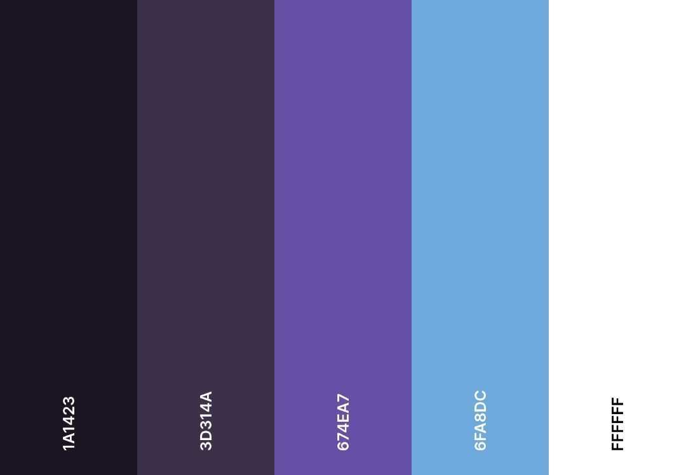

    
  
# **PYSIDIAN**

## **DESCRIPTION**

This program allows users to make notes, link/relate notes to other notes, and mark notes as important. It takes inspiration from obsidian notes, but sets itself apart by being made in python and allowing for the marking of notes as important

|                                  COLOR PALETTE                                  |                                                     DEMO                                                      |
| :-----------------------------------------------------------------------------: | :-----------------------------------------------------------------------------------------------------------: |
|  | <video width=100% controls><source src="README_example/Demo_Pysidian.mp4" type="video/mp4">DEMO Video</video> |

## **KEY FEATURES:**

A functional notes app that gives you freedom with relations and importance, an Easy to use, no hassle interface, and a good looking interface using only ascii characters

## **HOW TO USE (Visual Studio Code)**

Simply click the run button in the top right of the window and get to making notes. The specific commands are relayed on each loop denoted by \[brackets\]. Simply type the part inside the brackets to do that action. The program will tell you if you have tried to do something you cannot, like edit a note that doesn't exist, by printing the information to the console.
